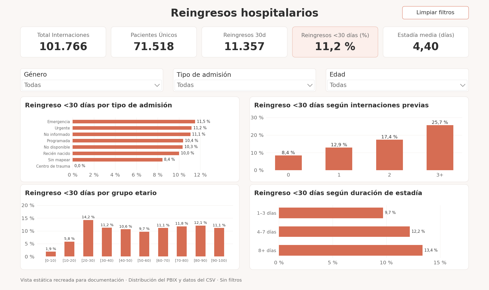
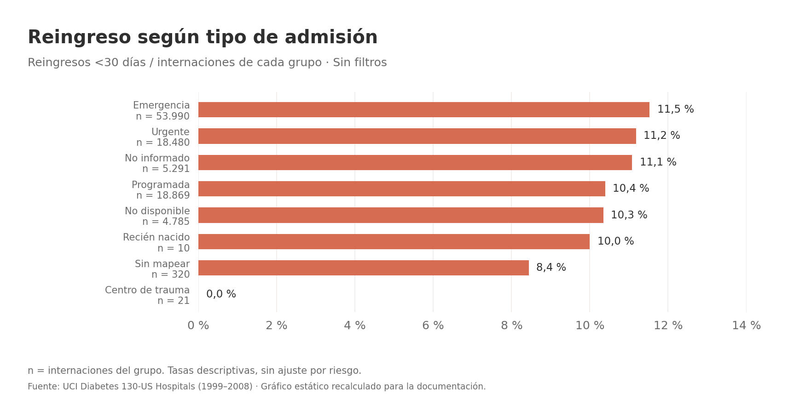
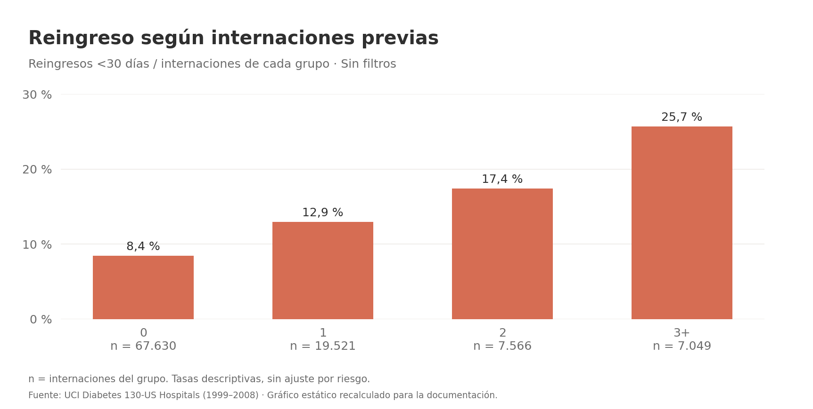
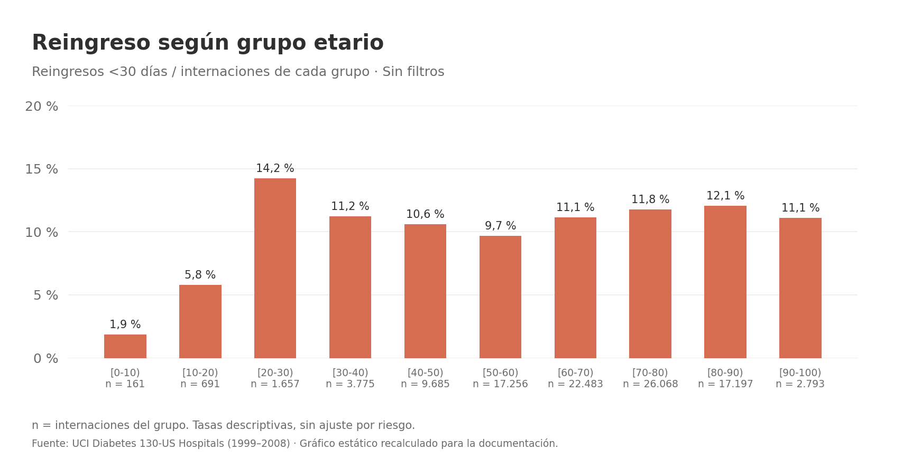
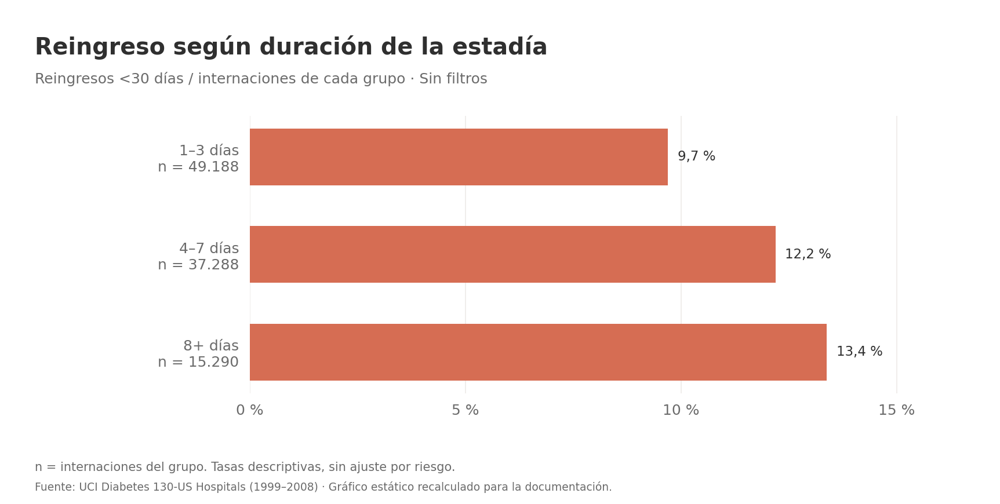

# Reingresos hospitalarios · SQL + Power BI

**De registros hospitalarios a un informe interactivo:** exploración, preparación y análisis de reingresos en menos de 30 días, con SQL Server y Power BI.

En este proyecto analicé cómo cambia la tasa de reingreso según el **tipo de admisión, las internaciones previas, la edad y la duración de la estadía**. Trabajé con el dataset público *Diabetes 130-US Hospitals for Years 1999–2008*, disponible en [UCI](https://doi.org/10.24432/C5230J).

*Vista estática recreada para la documentación a partir de la distribución del PBIX y los datos incluidos. El informe interactivo está en el archivo de Power BI.*

**[Descargar informe (.pbix)](powerbi/hospital_readmissions_dashboard.pbix?raw=true)** · [Consultas SQL](sql/) · [Cómo reproducirlo](docs/reproducir.md)

## El proyecto en números

| Indicador | Sin filtros | Qué representa |
|---|---:|---|
| Internaciones | **101.766** | Filas del dataset preparado |
| Pacientes únicos | **71.518** | Identificadores de paciente distintos |
| Reingresos <30 días | **11.357** | Internaciones con la etiqueta original `<30` |
| Tasa de reingreso <30 días | **11,16 %** | Reingresos / internaciones; la tarjeta muestra 11,2 % |
| Estadía media | **4,40 días** | Promedio de días de internación |

Una fila representa una **internación**, por lo que un paciente puede aparecer varias veces. El dataset reúne registros históricos con diagnóstico de diabetes de hospitales y redes asistenciales de Estados Unidos. [Descripción de los datos](https://archive.ics.uci.edu/dataset/296/diabetes+130+us+hospitals+for+years+1999+2008).

## Qué hice en SQL

Cargué los datos en SQL Server, en la base `HospitalReadmissions`. Importé el CSV principal como `dbo.diabetic_data_raw` y utilicé los catálogos para agregar descripciones a los códigos administrativos. Organicé el trabajo en cuatro etapas:

| Paso | Qué hice | Archivo |
|---|---|---|
| **1. Explorar** | Revisé conteos, pacientes únicos, duplicados de internación, tipos de datos, distribuciones y valores faltantes `?` | [01_exploracion.sql](sql/01_exploracion.sql) |
| **2. Relacionar** | Apliqué `LEFT JOIN` con los catálogos de admisión, origen y alta, y creé `vw_encounters_enriched` | [02_mapeos_y_joins.sql](sql/02_mapeos_y_joins.sql) |
| **3. Preparar** | Utilicé `NULLIF` para los faltantes, generé indicadores de reingreso, sumé las visitas previas y creé `vw_encounters_clean` | [03_limpieza_y_preparacion.sql](sql/03_limpieza_y_preparacion.sql) |
| **4. Analizar** | Calculé KPIs y tasas por grupos, definí categorías con `CASE` y resumí los registros por paciente con CTE | [04_kpis_y_analisis.sql](sql/04_kpis_y_analisis.sql) |

Conservé la tabla original y realicé la preparación mediante **vistas**. Comparé los conteos antes y después de los joins para comprobar que no se perdieran ni se multiplicaran las internaciones. Después conecté Power BI a `vw_encounters_clean` y creé las medidas DAX que responden a los filtros del informe.

## Cómo interpretar los gráficos

**Cada barra muestra la tasa dentro de su propio grupo:**

> Tasa de reingreso = internaciones del grupo etiquetadas `<30` / total de internaciones del grupo × 100.

Las barras no tienen que sumar 100 %. Tampoco representan cuántos pacientes únicos reingresaron. Para acompañar el informe, incluí los siguientes gráficos estáticos, recalculados desde el CSV del proyecto; `n` indica la cantidad de internaciones del grupo.

### Tipo de admisión

Comparé categorías como Emergencia, Urgente y Programada. Emergencia registra **11,52 %**. Los grupos pequeños requieren contexto: «Recién nacido» tiene **10 internaciones** y «Centro de trauma», **21**; el 0 % observado en este último no demuestra ausencia de riesgo.

### Internaciones previas

Agrupé `number_inpatient` en **0, 1, 2 y 3+**. Observé que la tasa pasa de **8,44 %** a **25,66 %** entre los extremos. Es una asociación descriptiva con las internaciones previas registradas. La variable SQL `prior_healthcare_visits` tiene otro alcance: también suma consultas ambulatorias y visitas a emergencias.

### Grupo etario

Utilicé los intervalos originales de edad para comparar las tasas. **[20–30)** significa desde 20 años hasta antes de cumplir 30. Ese grupo registra **14,24 %**; la tasa no aumenta de forma uniforme con la edad.

### Duración de la estadía

Dividí las estadías en **1–3, 4–7 y 8+ días**. Encontré tasas de **9,69 %, 12,19 % y 13,37 %**, respectivamente. El patrón no demuestra que una internación más larga cause un reingreso: pueden intervenir otras características de los pacientes.

## Cómo usar el dashboard

1. Descargar el repositorio con **Code → Download ZIP**, descomprimirlo y abrir `powerbi/hospital_readmissions_dashboard.pbix` en **Power BI Desktop para Windows**, preferentemente actualizado.
2. Filtrar por **Género**, **Tipo de admisión** o **Edad**. Los indicadores y gráficos se recalculan para la selección.
3. Pasar el cursor por una barra: los cuatro gráficos incluyen **Total Internaciones** y **Reingresos 30d** en la información sobre herramientas, para contextualizar la tasa.
4. Usar **Limpiar filtros** para borrar las selecciones de las segmentaciones. Durante la edición en Desktop, se ejecuta con **Ctrl + clic**. El botón no borra filtros puestos directamente en el panel Filtros.

El PBIX incluye un modelo importado. Para explorar esa copia no hace falta actualizar SQL Server; para **Actualizar** los datos sí hay que preparar la base y configurar el origen propio. [Instrucciones de reproducción](docs/reproducir.md).

## Archivos del repositorio

| Carpeta | Contenido |
|---|---|
| [`data/`](data/) | Dataset principal, `IDS_mapping.csv` y los tres catálogos separados |
| [`sql/`](sql/) | Las cuatro etapas del análisis y el archivo auxiliar `sql.slnx` |
| [`powerbi/`](powerbi/) | Informe actualizado `.pbix` y tema coral `.json` |
| [`images/`](images/) | Vista estática general y cuatro gráficos para la documentación |
| [`docs/`](docs/) | Reproducción, metodología, resultados verificados y guía de publicación |

## Fuente y créditos

Clore, J., Cios, K., DeShazo, J. y Strack, B. (2014). *Diabetes 130-US Hospitals for Years 1999–2008*. UCI Machine Learning Repository. [DOI: 10.24432/C5230J](https://doi.org/10.24432/C5230J). Dataset bajo **CC BY 4.0**; las transformaciones se documentan en este repositorio.
